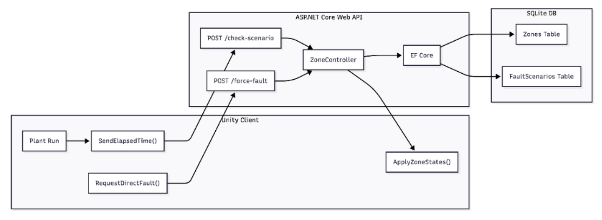
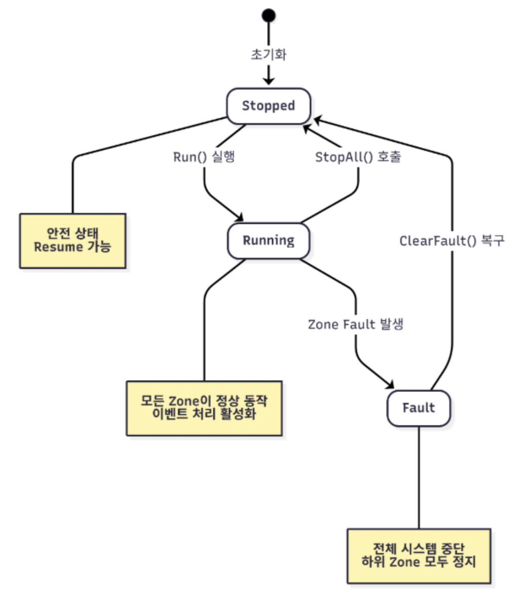
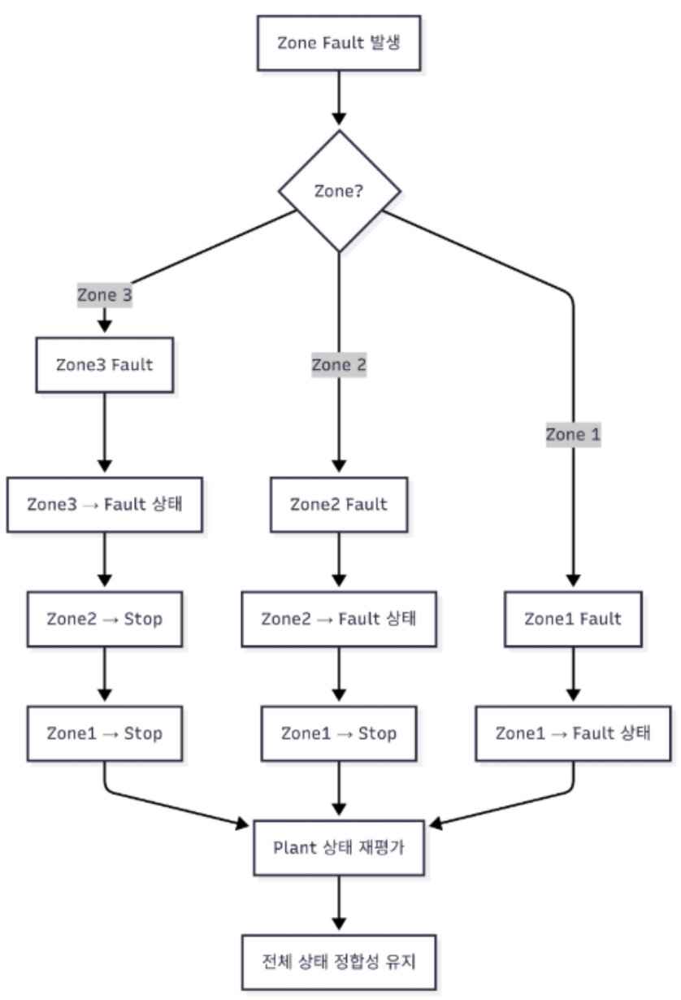

# AutoSim – State-driven Industrial Process Simulation

Unity 기반 공정 시뮬레이션 시스템으로  
**enum 기반 상태 제어(State-driven Architecture)** 와  
**Fault 전파 로직(Fault Propagation)** 을 설계했습니다.

또한 **Unity Client – ASP.NET Core Web API – SQLite DB 구조**를 구성하여  
공정 상태 데이터를 서버와 동기화하고 JSON 데이터 로그를 기록합니다.

---

# Project Overview

AutoSim은 제조 공정의 상태 제어와 Fault 처리 흐름을 중심으로 설계된 시뮬레이션 시스템입니다.

- Zone 단위 상태 관리 구조
- Plant 전체 상태 재평가 시스템
- Server 기반 시나리오 제어
- Unity ↔ ASP.NET Core REST API 통신

공정 상태와 흐름은 **Unity 기반 환경에서 시각화했습니다.**

---

## System Architecture

  

Unity Client는 공정 상태를 시각화하고  
ASP.NET Core Web API를 통해 Zone 상태를 서버와 동기화합니다.

서버는 EF Core를 사용하여 SQLite DB의 Zone 및 FaultScenario 데이터를 조회하고  
응답된 ZoneResponse를 기반으로 Unity에서 상태를 적용합니다.

---

## State Transition

  

Plant 상태는 enum 기반 구조로 관리됩니다.

- **Stopped**
- **Running**
- **Fault**

Fault 발생 시 상태 전이를 통해 공정 흐름을 제어하며  
ClearFault 이후 Resume이 가능하도록 설계했습니다.

---

## Fault Propagation Logic

  

특정 Zone에서 Fault가 발생하면  
상위 Zone에 Stop 상태가 전파됩니다.

Fault 전파 이후 Plant 상태를 재평가하여  
전체 공정 상태의 정합성을 유지하도록 설계했습니다.

---

# Core Design

- Enum 기반 State-driven Architecture
- Event 기반 공정 흐름 처리
- Queue 기반 Buffer 관리 구조
- Fault → Stop → Resume 복구 흐름 설계
- Client – Server 책임 분리 설계

---

# Tech Stack

### Client
- Unity (C#)
- UnityWebRequest
- Event-driven Architecture

### Server
- ASP.NET Core (.NET 8)
- Entity Framework Core
- REST API

### Database
- SQLite

### Data
- JSON Data Logging

---

