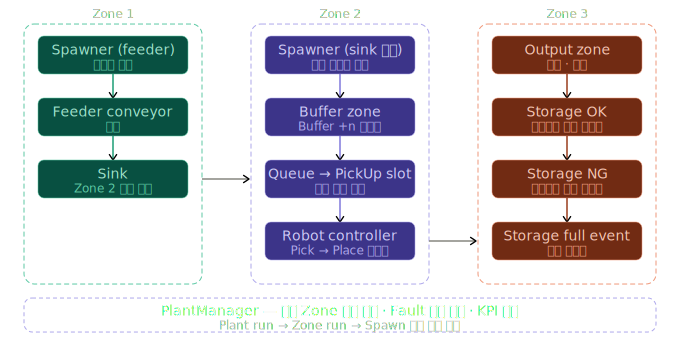

# AutoSim – State-driven Industrial Process Simulation

**enum 기반 상태 제어(State-driven Architecture)** 와 **Fault 전파 로직(Fault Propagation)** 을 직접 설계한 공정 자동화 시뮬레이션 프로젝트입니다.  
**Client – Server – DB 구조**로 공정 상태를 서버와 동기화하며, JSON으로 데이터 로그를 로컬에 별도 기록합니다.  
공정 흐름과 상태 변화는 3D 환경에서 실시간으로 시각화됩니다.

---

## Project Overview

AutoSim은 제조 공정의 상태 제어와 Fault 처리 흐름을 중심으로 설계한 시뮬레이션 시스템입니다.

- **Zone 단위 상태 관리** — PlantManager 하위에 Zone 1 / 2 / 3이 계층 구조로 동작
- **계층적 실행 허용 구조** — Plant run → Zone run → Spawn 순서로 상위가 허용해야 하위 동작 가능
- **두 가지 운영 모드** — 시나리오 모드(DB 기반 자동 Fault 발생) / 테스트 모드(수동 Fault 조작)
- **Fault · Stop 분리 설계** — 에러 상태(Fault)와 정지 상태(Stop)를 독립 트리거로 구분
- **Server 기반 시나리오 제어** — Basic / Hard 난이도로 Zone 순차 Fault 시나리오 실행
- **KPI 실시간 표시** — Total / OK / NG / Fault Count를 UI에 시각화
- 공정 상태와 흐름은 3D 시뮬레이션 환경에서 시각화했습니다.

---

## System Architecture

<p align="center">
  
</p>

Unity Client는 Menu Scene에서 시나리오·속도를 설정한 뒤 Main Scene으로 전환하며 공정을 시작합니다.  
Main Scene은 PlantManager를 최상위로 ZoneManager × 3, Spawner, RobotController, Storage(OK/NG)로 구성됩니다.  
ASP.NET Core Web API를 통해 Zone 상태를 서버와 동기화하고, EF Core로 SQLite DB의 Zone 및 FaultScenario 데이터를 조회합니다.  
OK / NG / Fault Count 등 공정 집계 데이터는 서버와 분리하여 JSON으로 로컬에 별도 저장합니다.

---

## Process Flow

<p align="center">
  
</p>

Zone 1(피더 생산) → Zone 2(버퍼·큐·로봇 시퀀스) → Zone 3(판정·스토리지) 순서로 아이템이 흐르며,  
Storage가 가득 차면 자동으로 비워지는 이벤트가 발생합니다.

---

## State Transition

<p align="center">
  
</p>

PlantManager / ZoneManager / Spawner는 각각 독립적인 상태를 가지며, 상위 상태가 허용할 때만 하위가 동작합니다.

| 상태 | 신호등 | 설명 |
|------|--------|------|
| Idle | Blue | 초기 대기 상태 |
| Running | Blue | 정상 동작 중 |
| Waiting | Yellow | 하위 Zone Fault로 수신 없음 · 사실상 정지 |
| Fault | Red | 에러 발생 · 해제 버튼 필요 |
| Stopped | Yellow | Fault 해제 후 경유 또는 Stop 버튼 직접 진입 |

**Fault와 Stop은 독립적인 트리거입니다.**  
Fault는 에러 발생 시 자동 또는 수동으로 진입하며, 반드시 Fault 해제 버튼을 눌러야 Stopped로 전환됩니다.  
Stop은 버튼으로 Running에서 직접 Stopped로 진입하며, 두 경로 모두 `Zone run → Spawn` 순서로 재가동합니다.

---

## Fault Propagation Logic

<p align="center">
  
</p>

특정 Zone에서 Fault가 발생하면 상위 Zone에 딜레이 후 순차적으로 Stop이 전파됩니다.

| Fault 발생 위치 | 전파 방향 |
|----------------|-----------|
| Zone 3 | Zone 2 Stopped (딜레이) → Zone 1 Stopped (딜레이) |
| Zone 2 | Zone 1 Stopped (딜레이) · Zone 3 Waiting |
| Zone 1 | Zone 2 · Zone 3 Waiting |

Fault 해제 버튼 입력 후 Plant 상태를 재평가하여 전체 정합성을 유지합니다.  
이후 `Zone run → Spawn` 순서로만 공정 재개가 가능하도록 설계했습니다.

---

## Core Design

| 설계 항목 | 내용 |
|-----------|------|
| State-driven Architecture | enum 기반 Plant / Zone / Robot 상태 제어 |
| 계층적 실행 허용 | Plant run → Zone run → Spawn 단계별 허용 구조 |
| Event-driven Flow | OnQueueChanged · OnBecameIdle 이벤트 기반 공정 흐름 |
| Fault · Stop 분리 | 에러와 정지를 독립 트리거로 구분 설계 |
| Fault 전파 | 하위 Zone Fault → 상위 Zone 순차 정지 |
| Client–Server 책임 분리 | 상태 판단은 서버, 시각화는 클라이언트 |
| 데이터 이중 저장 | 시나리오·로그는 SQLite DB, 집계 카운트는 JSON 로컬 |

---

## Tech Stack

### Client
- Unity (C#)
- UnityWebRequest
- Event-driven Architecture

### Server
- ASP.NET Core (.NET 8)
- Entity Framework Core
- REST API

### Database
- SQLite

### Data
- **공정 집계 저장** — `total / ok / ng / faultCount` 를 JSON으로 로컬 기록 (서버와 분리)
- **세션 이벤트 로그** — 세션 단위로 `sessionInfo / events / summary` 구조로 day 기준 기록

<details>
<summary>JSON 샘플 보기</summary>

**공정 집계 (status.json)**
```json
{
  "total": 311,
  "ok": 289,
  "ng": 22,
  "faultCount": 58
}
```

**세션 이벤트 로그 (log_2026-xx-xx.json)**
```json
{
  "sessionInfo": {
    "sessionId": "2026-02-21_20-51-28",
    "startTime": "2026-02-21 20:51:28",
    "endTime": "2026-02-21 20:51:31"
  },
  "events": [
    {
      "time": "20:51:28.861",
      "type": "RunStarted",
      "zone": "Plant",
      "message": "Plant Run",
      "result": ""
    }
  ],
  "summary": {
    "total": 0,
    "ok": 0,
    "ng": 0,
    "faultCount": 0,
    "endTime": "2026-02-21 20:51:31"
  }
}
```

</details>
